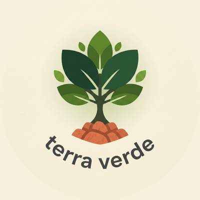
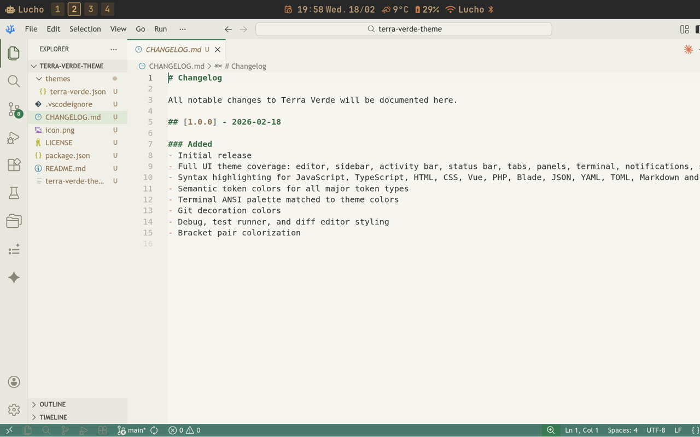
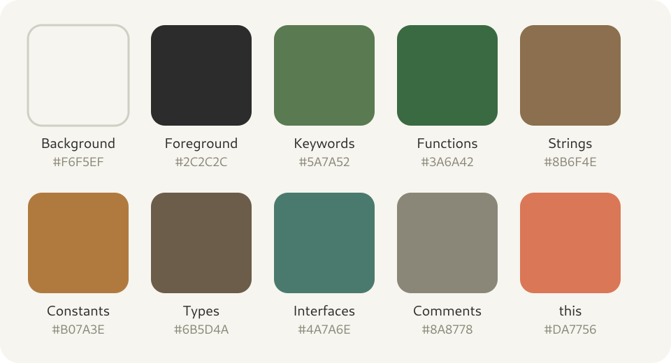

<p align="center">
  
</p>

# Terra Verde

A light theme for Visual Studio Code inspired by earth, moss, and forest.

Warm off-whites, deep forest greens, and terracotta accents — designed to be easy on the eyes during long coding sessions without sacrificing clarity.



---

## Color Palette

<p align="center">
  
</p>

---

## Language Support

Syntax highlighting is tuned for:

- JavaScript / TypeScript
- HTML / CSS
- Vue (directives)
- PHP / Blade
- JSON / YAML / TOML
- Markdown
- Python, Rust, Go, and more via semantic highlighting

---

## Features

- Semantic highlighting enabled
- Full bracket pair colorization
- Terminal ANSI colors matched to the palette
- Git decorations in theme colors
- Debug, test, and diff views styled

---

## Installation

Available on **[Open VSX Registry](https://open-vsx.org/extension/lucianofedericopereira/terra-verde-theme)** — the open extension marketplace used by [VSCodium](https://vscodium.com) and other VS Code-compatible editors.

### VSCodium (recommended)

[VSCodium](https://vscodium.com) is a community-built binary of VS Code with **telemetry and tracking removed by default**. It uses Open VSX instead of the Microsoft Marketplace.

1. Open **Extensions** (`Ctrl+Shift+X`)
2. Search for **Terra Verde**
3. Click **Install**
4. Open **Command Palette** (`Ctrl+Shift+P`) → `Preferences: Color Theme` → select **Terra Verde**

### VS Code

> **Note:** This extension is not published on the Microsoft Marketplace. Microsoft requires a credit card to create a publisher account, even for free extensions. VS Code also sends telemetry data to Microsoft by default — you can disable it under `Settings → Telemetry → off`, but the binary itself remains proprietary. Consider switching to VSCodium.

Install manually from the [Open VSX page](https://open-vsx.org/extension/lucianofedericopereira/terra-verde-theme) by downloading the `.vsix` and running:

```bash
code --install-extension terra-verde-theme-1.0.0.vsix
```

Or via Extensions → `...` menu → **Install from VSIX**.

---

## License

[Apache 2.0](LICENSE) — Luciano Federico Pereira
